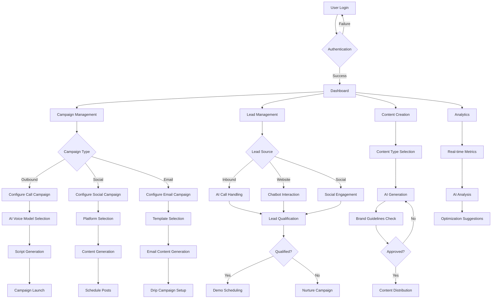
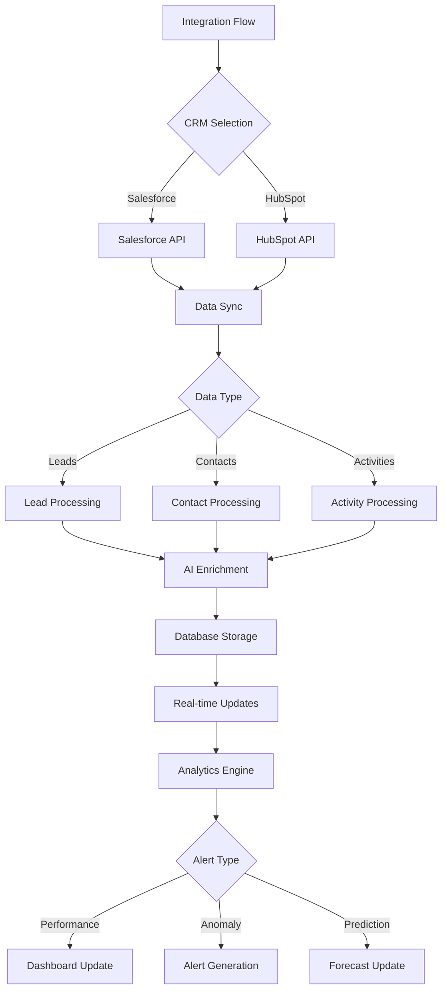
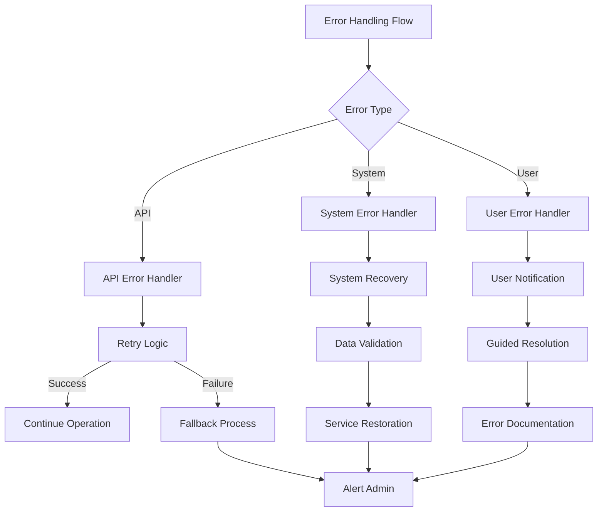
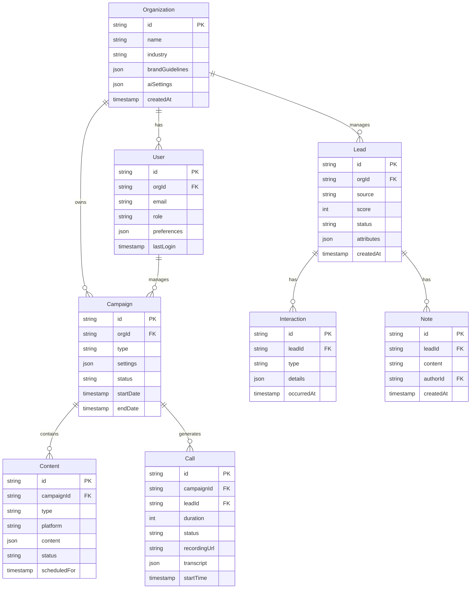
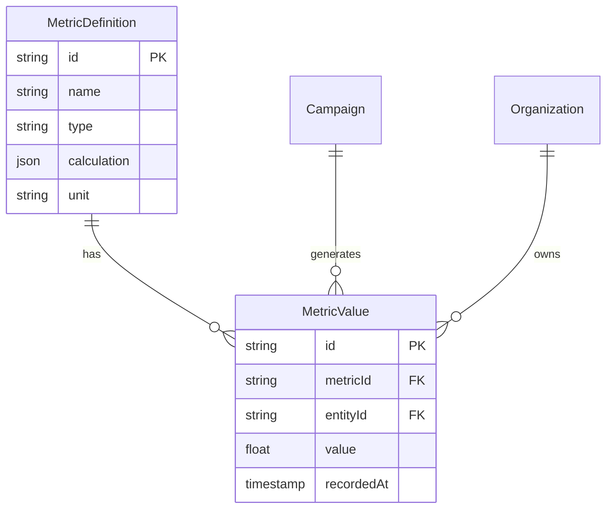
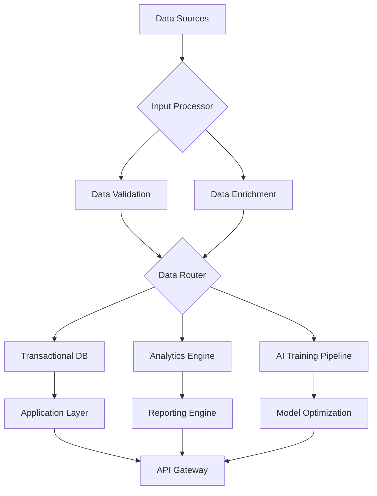
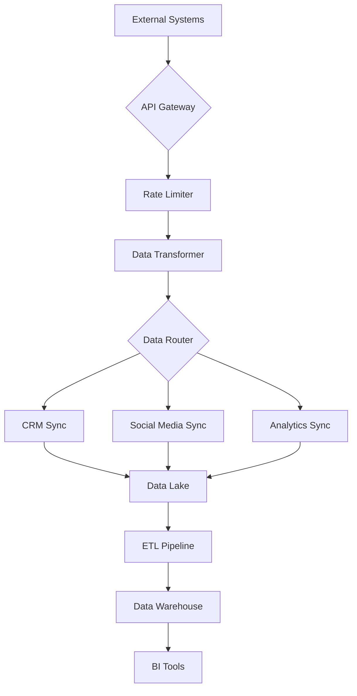
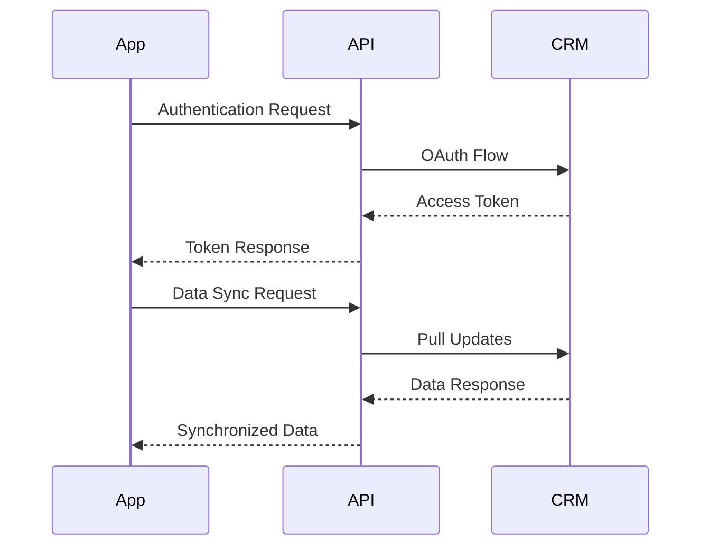
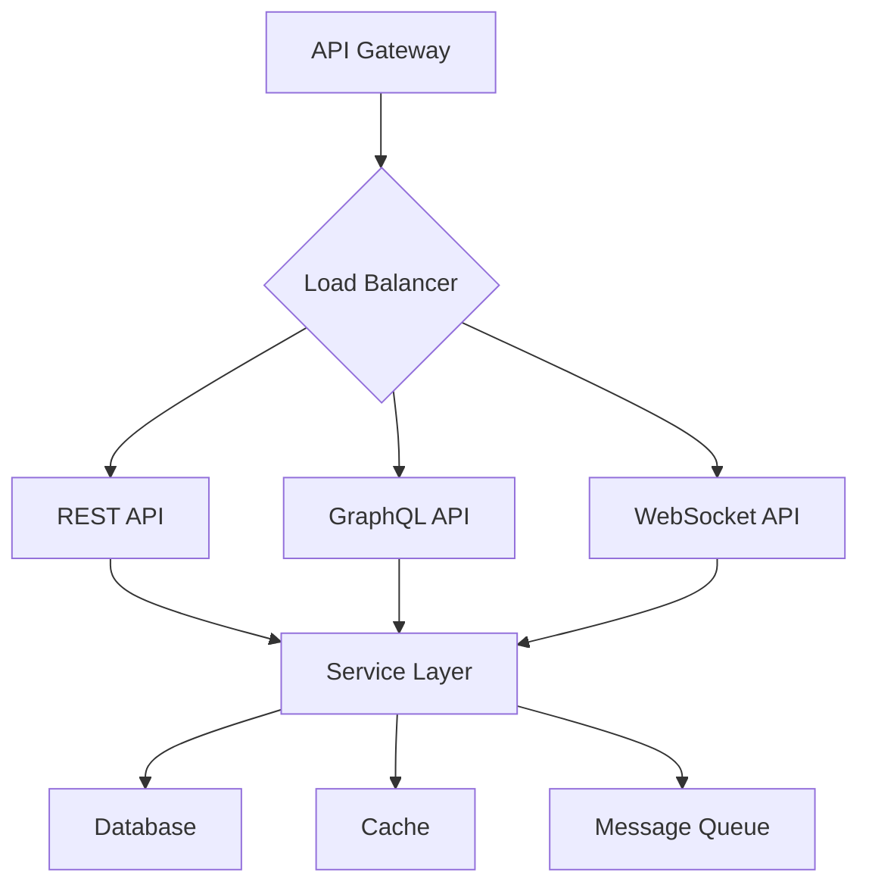

# Product Requirements Document (PRD)

# 1. INTRODUCTION

## 1.1 Purpose

This Software Requirements Specification (SRS) document provides a comprehensive description of the autonomous AI-driven revenue generation platform. It details the functional and non-functional requirements for developers, project managers, QA teams, and stakeholders involved in the development and deployment of the system.

## 1.2 Scope

The autonomous revenue generation platform is a comprehensive AI-driven system designed to automate key revenue-generating activities for businesses of all sizes. The system encompasses:

- Autonomous outbound and inbound call handling
- AI-powered content creation and social media management
- Automated lead generation and qualification
- Campaign creation and optimization
- Real-time analytics and reporting
- Integration capabilities with CRM and marketing tools

Key benefits include:
- Reduction in human resource requirements for revenue generation
- 24/7 operational capability
- Scalable from single-user to enterprise deployment
- Potential to generate $1M ARR within 12 months
- Self-learning and optimization capabilities

The system will be deployed as a cloud-based SaaS solution, built on modern web technologies with extensive AI/ML capabilities. Initial release will focus on core lead generation and social posting features, with subsequent phases introducing advanced functionality like voice-based handling and autonomous revenue generation.

# 2. PRODUCT DESCRIPTION

## 2.1 Product Perspective

The autonomous revenue generation platform operates as a cloud-based SaaS solution that integrates with existing business systems while functioning as a standalone revenue generation engine. The system interfaces with:

- CRM systems (HubSpot, Salesforce)
- Social media platforms (TikTok, LinkedIn, Twitter, Instagram)
- Email marketing services (Mailchimp, SendGrid)
- Project management tools (Notion)
- Voice/telephony systems
- Payment processing systems

The platform will be deployed on major cloud providers (AWS/Azure/GCP) to ensure scalability and reliability.

## 2.2 Product Functions

The system provides these core functions:

| Function Category | Key Capabilities |
|------------------|------------------|
| Lead Generation | - Autonomous outbound calling - Inbound call handling - Lead qualification - Demo scheduling |
| Content Management | - Social media post creation - Content scheduling - Multi-platform distribution - Brand guideline enforcement |
| Campaign Management | - Campaign creation wizard - Performance optimization - A/B testing - ROI tracking |
| Analytics | - Real-time dashboards - Predictive analytics - Lead scoring - Revenue forecasting |
| AI Operations | - LLM-powered conversations - Voice recognition/synthesis - Autonomous decision making - Self-learning optimization |

## 2.3 User Characteristics

Primary user personas include:

1. Solo Entrepreneur
   - Technical proficiency: Moderate
   - Time availability: Limited
   - Primary need: Full automation of revenue generation

2. Small Business Owner
   - Technical proficiency: Basic to moderate
   - Time availability: Partial
   - Primary need: Lead generation and social presence

3. Marketing Manager
   - Technical proficiency: Advanced
   - Time availability: Dedicated
   - Primary need: Campaign optimization and analytics

4. Enterprise Administrator
   - Technical proficiency: Expert
   - Time availability: Full-time
   - Primary need: System integration and user management

## 2.4 Constraints

1. Technical Constraints
   - Must operate within API rate limits of integrated platforms
   - Real-time voice processing latency requirements
   - Storage limitations for call recordings and content
   - AI model processing capacity

2. Regulatory Constraints
   - CCPA compliance required
   - GDPR compliance for potential EU expansion
   - Telemarketing regulations
   - Data privacy requirements

3. Business Constraints
   - Initial 2-month development timeline
   - Budget allocation for AI API costs
   - Scaling requirements (1 to 1000+ organizations in 6 months)
   - $1M ARR target within 12 months

## 2.5 Assumptions and Dependencies

Assumptions:
- Users have basic understanding of digital marketing concepts
- Stable internet connectivity for cloud-based operations
- Access to required business information for AI training
- Availability of quality training data for AI models

Dependencies:
- Third-party API availability and reliability
- LLM provider uptime and performance
- Cloud infrastructure stability
- Integration partner compatibility
- Social media platform API stability
- Voice service provider reliability
- Payment processor availability

# 3. PROCESS FLOWCHART

# 4. FUNCTIONAL REQUIREMENTS

## 4.1 Lead Generation & Management

### ID: F001
### Description
Autonomous system for generating, qualifying and nurturing leads through multiple channels
### Priority: P0 (Critical)

| Requirement ID | Requirement Description | Acceptance Criteria |
|---------------|------------------------|-------------------|
| F001.1 | System must autonomously place outbound calls to prospects | - Minimum 50 calls/day - 10% connection rate - Natural voice synthesis - Call recording & transcription |
| F001.2 | System must handle inbound calls 24/7 | - Zero missed calls - < 2s response time - Natural conversation flow - Proper call routing |
| F001.3 | Lead qualification using AI | - Standardized scoring system - Custom qualification criteria - Real-time updates to CRM - Automated follow-up scheduling |
| F001.4 | Demo scheduling capabilities | - Calendar integration - Automated reminders - Rescheduling handling - Meeting link generation |

## 4.2 Content Creation & Social Media

### ID: F002
### Description
AI-powered content generation and social media management system
### Priority: P0 (Critical)

| Requirement ID | Requirement Description | Acceptance Criteria |
|---------------|------------------------|-------------------|
| F002.1 | Generate platform-specific social media content | - Multi-platform optimization - Brand voice consistency - Image/video suggestions - Hashtag optimization |
| F002.2 | Content scheduling and distribution | - Multi-platform posting - Optimal timing algorithms - Content calendar view - Bulk scheduling |
| F002.3 | Content performance tracking | - Engagement metrics - Platform-specific analytics - A/B testing capabilities - ROI tracking |
| F002.4 | Brand guideline enforcement | - Style guide integration - Automated compliance checks - Version control - Approval workflows |

## 4.3 Campaign Management

### ID: F003
### Description
End-to-end campaign creation, optimization, and tracking system
### Priority: P1 (High)

| Requirement ID | Requirement Description | Acceptance Criteria |
|---------------|------------------------|-------------------|
| F003.1 | Campaign creation wizard | - Template library - Goal setting interface - Budget allocation - Channel selection |
| F003.2 | Performance optimization | - Real-time adjustments - A/B testing - Budget optimization - Audience targeting |
| F003.3 | Campaign analytics | - Real-time reporting - Custom metrics - Export capabilities - Visualization options |
| F003.4 | Multi-channel campaign management | - Cross-channel coordination - Unified dashboard - Resource allocation - Timeline management |

## 4.4 Analytics & Reporting

### ID: F004
### Description
Comprehensive analytics system with predictive capabilities
### Priority: P1 (High)

| Requirement ID | Requirement Description | Acceptance Criteria |
|---------------|------------------------|-------------------|
| F004.1 | Real-time dashboards | - Customizable views - Mobile optimization - Alert system - Data visualization |
| F004.2 | Predictive analytics | - Revenue forecasting - Trend analysis - Risk assessment - Opportunity identification |
| F004.3 | Custom reporting | - Report builder - Scheduled reports - Multiple export formats - Data filtering |
| F004.4 | Performance benchmarking | - Industry comparisons - Historical analysis - Goal tracking - KPI monitoring |

## 4.5 Integration Management

### ID: F005
### Description
System integration with external platforms and services
### Priority: P1 (High)

| Requirement ID | Requirement Description | Acceptance Criteria |
|---------------|------------------------|-------------------|
| F005.1 | CRM integration | - Bi-directional sync - Real-time updates - Field mapping - Error handling |
| F005.2 | Social media platform integration | - API connectivity - Authentication management - Rate limit handling - Error recovery |
| F005.3 | Email service integration | - SMTP/API support - Template sync - List management - Bounce handling |
| F005.4 | Payment processing integration | - Multiple gateway support - Transaction logging - Refund handling - Security compliance |

## 4.6 AI Operations

### ID: F006
### Description
Core AI functionality and model management
### Priority: P0 (Critical)

| Requirement ID | Requirement Description | Acceptance Criteria |
|---------------|------------------------|-------------------|
| F006.1 | LLM conversation management | - Context retention - Model selection - Response optimization - Fallback handling |
| F006.2 | Voice synthesis/recognition | - Natural speech patterns - Multiple languages - Accent handling - Noise reduction |
| F006.3 | Self-learning optimization | - Performance tracking - Model fine-tuning - Feedback integration - Version control |
| F006.4 | Autonomous decision making | - Rule-based logic - Learning algorithms - Safety controls - Audit logging |

# 5. NON-FUNCTIONAL REQUIREMENTS

## 5.1 Performance Requirements

| Category | Requirement | Target Metric |
|----------|------------|---------------|
| Response Time | API endpoint response | < 200ms |
| | Page load time | < 2s |
| | Voice processing latency | < 100ms |
| | Real-time analytics updates | < 1s |
| Throughput | Concurrent users | 10,000+ |
| | API requests/second | 1000+ |
| | Outbound calls/minute | 100+ |
| Resource Usage | CPU utilization | < 70% |
| | Memory usage | < 80% |
| | Storage IOPS | 10,000+ |
| | Network bandwidth | 1 Gbps+ |

## 5.2 Safety Requirements

| Requirement | Description | Implementation |
|-------------|-------------|----------------|
| Data Backup | - Automated daily backups - Point-in-time recovery - Multi-region replication | AWS S3 with versioning |
| Failure Recovery | - Automatic failover - Load balancing - Circuit breakers | AWS Auto Scaling Groups |
| Error Handling | - Graceful degradation - Fallback mechanisms - Error logging | CloudWatch Logs |
| Data Integrity | - Checksums - Validation checks - Audit trails | Database constraints |

## 5.3 Security Requirements

| Category | Requirement | Implementation |
|----------|-------------|----------------|
| Authentication | - Multi-factor authentication - SSO integration - Password policies | Auth0/Cognito |
| Authorization | - Role-based access control - Least privilege principle - API key management | JWT tokens |
| Encryption | - Data at rest encryption - TLS 1.3 in transit - Key rotation | AWS KMS |
| Privacy | - Data anonymization - PII protection - Consent management | Custom middleware |
| Monitoring | - Security event logging - Intrusion detection - Vulnerability scanning | CloudWatch/GuardDuty |

## 5.4 Quality Requirements

### 5.4.1 Availability
- 99.9% uptime SLA
- Maximum planned downtime: 4 hours/month
- Redundant infrastructure across availability zones
- Active-active configuration

### 5.4.2 Maintainability
- Modular architecture
- Automated deployment pipelines
- Comprehensive documentation
- Code coverage > 80%
- Automated testing

### 5.4.3 Usability
- Mobile-responsive design
- WCAG 2.1 AA compliance
- Maximum 3 clicks to key functions
- Intuitive navigation
- Multi-language support

### 5.4.4 Scalability
- Horizontal scaling capability
- Auto-scaling based on load
- Database sharding support
- Microservices architecture
- CDN integration

### 5.4.5 Reliability
- Mean Time Between Failures (MTBF): > 720 hours
- Mean Time To Recovery (MTTR): < 15 minutes
- Zero data loss guarantee
- Automated health checks
- Self-healing capabilities

## 5.5 Compliance Requirements

| Regulation | Requirement | Implementation |
|------------|-------------|----------------|
| CCPA | - Data deletion capability - Privacy policy - Opt-out mechanisms | Custom privacy portal |
| GDPR | - Data portability - Consent management - Right to be forgotten | API endpoints |
| SOC 2 | - Access controls - Change management - Incident response | AWS Controls |
| PCI DSS | - Secure payment processing - Data encryption - Access logging | Stripe integration |
| HIPAA | - PHI protection - Audit trails - Business associate agreements | Encryption at rest |

# 6. DATA REQUIREMENTS

## 6.1 Data Models

### 6.1.1 Core Entities

### 6.1.2 Analytics Models

## 6.2 Data Storage

### 6.2.1 Primary Storage
- PostgreSQL for transactional data
- MongoDB for unstructured content and campaign data
- Redis for caching and real-time analytics

### 6.2.2 Data Retention
| Data Type | Retention Period | Storage Type |
|-----------|-----------------|--------------|
| Call Recordings | 90 days | S3 with lifecycle policies |
| Chat Transcripts | 1 year | MongoDB with archival |
| Campaign Data | 3 years | PostgreSQL + cold storage |
| Analytics Data | 5 years | Time-series DB + archival |
| User Activity Logs | 1 year | CloudWatch Logs |

### 6.2.3 Backup & Recovery
- Daily incremental backups to S3
- Weekly full backups across regions
- Point-in-time recovery capability for last 35 days
- 15-minute RPO (Recovery Point Objective)
- 1-hour RTO (Recovery Time Objective)

### 6.2.4 Data Redundancy
- Multi-AZ deployment for primary databases
- Cross-region replication for critical data
- Read replicas for analytics and reporting
- Active-active configuration for high availability

## 6.3 Data Processing

### 6.3.1 Data Flow

### 6.3.2 Data Security
| Layer | Security Measure | Implementation |
|-------|-----------------|----------------|
| Transport | TLS 1.3 | AWS Certificate Manager |
| Storage | AES-256 | AWS KMS |
| Access | Row-level security | PostgreSQL RLS |
| Audit | Change tracking | Audit logging tables |
| PII | Data masking | Custom encryption service |

### 6.3.3 Data Processing Rules
- Real-time processing for customer interactions
- Batch processing for analytics and reporting
- Stream processing for AI model training
- Event-driven architecture for system integrations
- Data validation before persistence
- Automated data quality checks
- Data transformation pipeline for analytics

### 6.3.4 Data Integration

# 7. EXTERNAL INTERFACES

## 7.1 User Interfaces

### 7.1.1 Web Application Interface

| Component | Requirements | Implementation |
|-----------|--------------|----------------|
| Dashboard | - Responsive design (320px to 4K) - Dark/light mode support - Real-time updates - Customizable widgets | React with Material UI |
| Navigation | - Sidebar/top navigation - Breadcrumb trails - Quick action menu - Search functionality | React Router with Redux |
| Forms | - Inline validation - Auto-save - Progress indicators - Multi-step wizards | Formik with Yup |
| Data Visualization | - Interactive charts - Export capabilities - Drill-down views - Custom date ranges | D3.js and Chart.js |

### 7.1.2 Mobile Interface

| Feature | Requirements | Implementation |
|---------|--------------|----------------|
| Progressive Web App | - Offline capability - Push notifications - Home screen installation | Workbox with Firebase |
| Touch Optimization | - Touch targets ≥ 44px - Swipe gestures - Pull-to-refresh | React Native Web |
| Responsive Layout | - Fluid grid system - Breakpoint optimization - Content prioritization | Tailwind CSS |

## 7.2 Hardware Interfaces

### 7.2.1 Voice Processing Hardware

| Component | Specification | Integration Method |
|-----------|--------------|-------------------|
| Microphone Input | - 16-bit/44.1kHz sampling - Noise cancellation - Echo suppression | WebRTC API |
| Audio Output | - Low latency (<50ms) - Multi-channel support - Hardware acceleration | Web Audio API |
| Processing Units | - GPU acceleration for ML - SIMD instruction support - Dedicated audio DSP | WebAssembly |

### 7.2.2 Storage Devices

| Type | Requirements | Implementation |
|------|--------------|----------------|
| Local Storage | - SSD preferred - 100GB minimum - IOPS: 10,000+ | AWS EBS |
| Backup Storage | - Redundant arrays - Geographic distribution - Encryption support | AWS S3 |

## 7.3 Software Interfaces

### 7.3.1 CRM Integration

| CRM Platform | Integration Method | Data Flow |
|--------------|-------------------|-----------|
| Salesforce | REST API + OAuth 2.0 | Bi-directional sync |
| HubSpot | API v3 + OAuth | Real-time webhooks |
| Notion | Integration API | Scheduled sync |

### 7.3.2 Social Media Integration

| Platform | API Version | Features |
|----------|------------|----------|
| LinkedIn | v2 | - Post scheduling - Analytics - Lead gen forms |
| Twitter | v2 | - Tweet management - Media upload - Engagement metrics |
| TikTok | Business API | - Content posting - Performance data - Audience insights |

## 7.4 Communication Interfaces

### 7.4.1 Network Protocols

| Protocol | Usage | Requirements |
|----------|-------|--------------|
| HTTPS | API Communication | - TLS 1.3 - Certificate pinning - HSTS enabled |
| WebSocket | Real-time Updates | - Secure WebSocket (WSS) - Auto-reconnect - Message queuing |
| gRPC | Internal Services | - HTTP/2 - Protocol buffers - Load balancing |

### 7.4.2 API Specifications

| API Type | Format | Authentication |
|----------|--------|----------------|
| REST | JSON/HAL | JWT + API Keys |
| GraphQL | Schema-based | OAuth 2.0 |
| WebSocket | Binary/JSON | Token-based |

### 7.4.3 Message Formats

| Type | Format | Validation |
|------|--------|------------|
| API Requests | JSON Schema | OpenAPI 3.0 |
| Events | CloudEvents | JSON Schema |
| File Transfer | Multipart/form-data | Content-Type verification |

# 8. APPENDICES

## 8.1 SECTION TITLE

### 8.1.1 Additional Technical Specifications

| Component | Details | Notes |
|-----------|---------|-------|
| LLM Integration | - GPT-4 for content generation - Claude for conversation handling - Custom fine-tuned models | Requires API key management |
| Voice Processing | - Amazon Polly for TTS - Whisper for STT - Custom voice cloning | Latency optimization needed |
| Social Media APIs | - TikTok Business API - LinkedIn Marketing API - Twitter API v2 | Rate limit monitoring |
| Project Management | - Notion API integration - Custom workflow automation | Bi-directional sync |

### 8.1.2 Monetization Details

| Tier | Features | Price Point |
|------|----------|-------------|
| Free | - 50 AI calls/month - Basic analytics - Single social platform | $0/month |
| Growth | - 1000 AI calls/month - Advanced analytics - 3 social platforms | Usage-based |
| Enterprise | - Unlimited AI usage - Custom model training - All platforms | Custom pricing |

## 8.2 GLOSSARY

| Term | Definition |
|------|------------|
| Autonomous Revenue Generation | Self-operating system that generates revenue without human intervention |
| Lead Qualification | Process of determining if a prospect fits ideal customer profile |
| Campaign Optimization | Automated improvement of marketing campaigns based on performance data |
| Model Fine-tuning | Process of customizing AI models with company-specific training data |
| Voice Synthesis | Generation of human-like speech from text input |
| Content Distribution | Multi-channel deployment of marketing materials |

## 8.3 ACRONYMS

| Acronym | Full Form |
|---------|-----------|
| ARR | Annual Recurring Revenue |
| LLM | Large Language Model |
| TTS | Text-to-Speech |
| STT | Speech-to-Text |
| ROI | Return on Investment |
| SLA | Service Level Agreement |
| CCPA | California Consumer Privacy Act |
| GDPR | General Data Protection Regulation |
| API | Application Programming Interface |
| CRM | Customer Relationship Management |
| KPI | Key Performance Indicator |
| IOPS | Input/Output Operations Per Second |

## 8.4 ADDITIONAL REFERENCES

### 8.4.1 Technical Documentation

| Resource | URL | Purpose |
|----------|-----|----------|
| AWS Documentation | aws.amazon.com/documentation | Cloud infrastructure reference |
| OpenAI API Docs | platform.openai.com/docs | LLM integration guide |
| TikTok Business API | developers.tiktok.com | Social media integration |
| Notion API | developers.notion.com | Project management integration |

### 8.4.2 Regulatory Guidelines

| Resource | Description |
|----------|-------------|
| CCPA Guidelines | California privacy compliance requirements |
| GDPR Documentation | EU data protection requirements |
| Telemarketing Regulations | Federal and state calling regulations |
| Data Privacy Framework | Internal data handling procedures |

### 8.4.3 Development Standards

| Standard | Application |
|----------|-------------|
| OpenAPI 3.0 | API documentation and design |
| OAuth 2.0 | Authentication protocol |
| CloudEvents | Event data structure |
| JWT | Token-based authentication |