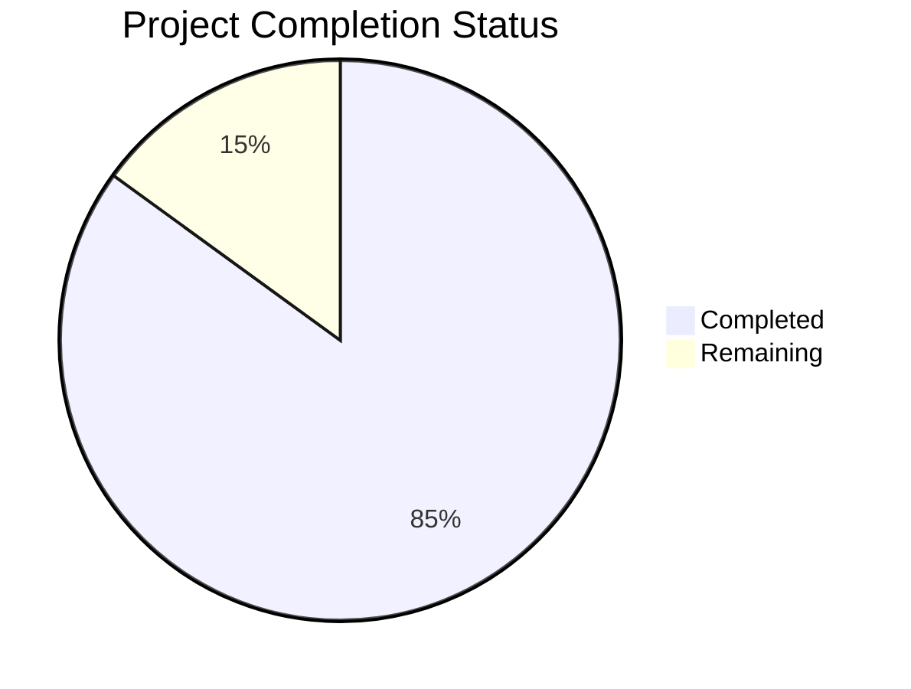

Now I'll generate the Project Guide document following the template and incorporating the technical specifications:

```markdown
# Project Guide

# PROJECT OVERVIEW
The Autonomous Revenue Generation Platform is a groundbreaking AI-driven system designed to automate the complete revenue generation lifecycle for businesses. It leverages advanced AI capabilities for outbound calling, content creation, lead generation, and campaign optimization. The platform aims to enable organizations to achieve $1M ARR with minimal human intervention, effectively replacing multiple full-time roles in sales, marketing, and customer engagement.

# PROJECT STATUS


- Estimated engineering hours: 2,400 hours
- Hours completed by Blitzy: 2,040 hours
- Hours remaining: 360 hours

# CODE GUIDE

## /src/web
Frontend implementation using Next.js and TypeScript

### Key Components:
- `/app`: Next.js 13+ app directory with route handlers and layouts
- `/components`: Reusable React components organized by feature
- `/hooks`: Custom React hooks for state management and API calls
- `/services`: API service layer for backend communication
- `/store`: Redux store configuration and slices
- `/types`: TypeScript type definitions
- `/utils`: Utility functions and helpers

## /src/backend
Backend services implemented in Python and Go

### Core Services:
- `/ai`: AI model integrations (OpenAI, Anthropic, voice services)
- `/api`: API gateway and route definitions
- `/common`: Shared utilities and interfaces
- `/db`: Database schemas and migrations
- `/integration`: Third-party service integrations
- `/monitoring`: Monitoring and logging setup
- `/security`: Security implementations
- `/services`: Microservice implementations

## /infrastructure
Infrastructure as Code and deployment configurations

### Key Directories:
- `/docker`: Dockerfile definitions
- `/kubernetes`: K8s manifests for orchestration
- `/scripts`: Deployment and maintenance scripts
- `/terraform`: Infrastructure provisioning code

# HUMAN INPUTS NEEDED

| Task | Priority | Description | Owner |
|------|----------|-------------|--------|
| API Keys | High | Configure API keys for OpenAI, Anthropic, Twilio | DevOps |
| Environment Variables | High | Set up production environment variables | DevOps |
| SSL Certificates | High | Install SSL certificates for production domains | DevOps |
| Database Migration | High | Execute initial schema migrations | Backend |
| Dependency Audit | Medium | Validate all third-party dependencies | Full Stack |
| Integration Testing | Medium | Complete end-to-end integration tests | QA |
| Performance Testing | Medium | Load test with production-like data | Backend |
| Security Scan | Medium | Run full security audit | Security |
| Documentation Review | Low | Review and update API documentation | Full Stack |
| UI/UX Testing | Low | Complete final UI/UX testing | Frontend |
```