# Technical Specifications

# 1. INTRODUCTION

## 1.1 EXECUTIVE SUMMARY

The Autonomous Revenue Generation Platform represents a groundbreaking AI-driven system designed to automate the complete revenue generation lifecycle for businesses of all sizes. This platform addresses the critical challenge of scaling revenue operations without proportionally increasing human resources by leveraging advanced AI capabilities for outbound calling, content creation, lead generation, and campaign optimization.

The system aims to enable organizations to achieve $1 million in Annual Recurring Revenue (ARR) with minimal human intervention, effectively replacing multiple full-time roles in sales, marketing, and customer engagement. Primary stakeholders include solo entrepreneurs, small business owners, marketing teams, and enterprise organizations seeking to automate and scale their revenue operations.

## 1.2 SYSTEM OVERVIEW

### Project Context

| Aspect | Details |
| --- | --- |
| Market Position | First-to-market autonomous revenue generation platform leveraging advanced AI capabilities |
| Current Limitations | Traditional systems require significant human resources, leading to scalability constraints and burnout |
| Enterprise Integration | Seamless integration with existing CRM systems, marketing tools, and communication platforms |

### High-Level Description

| Component | Capabilities |
| --- | --- |
| AI Core | - LLM-powered conversations<br>- Voice synthesis/recognition<br>- Autonomous decision making<br>- Self-learning optimization |
| Revenue Generation | - Outbound/inbound call handling<br>- Lead qualification and nurturing<br>- Demo scheduling<br>- Social media management |
| Technical Architecture | - Cloud-native SaaS platform<br>- Microservices architecture<br>- Event-driven design<br>- Real-time analytics engine |

### Success Criteria

| Category | Metrics |
| --- | --- |
| Revenue Targets | - $300k revenue within 6 months<br>- $1M ARR within 12 months |
| System Performance | - 99.9% uptime<br>- \<200ms API response time<br>- 10,000+ concurrent users |
| User Adoption | - 1000+ organizations within 6 months<br>- \<30-minute onboarding time<br>- \>80% user satisfaction rate |

## 1.3 SCOPE

### In-Scope Elements

| Category | Components |
| --- | --- |
| Core Features | - Autonomous outbound calling<br>- AI-driven content creation<br>- Lead generation and qualification<br>- Campaign optimization<br>- Analytics and reporting |
| Implementation | - Cloud deployment (AWS/Azure/GCP)<br>- CRM integrations<br>- Social media platform connections<br>- Payment processing<br>- Security compliance |
| User Groups | - Solo entrepreneurs<br>- Small business owners<br>- Marketing teams<br>- Enterprise administrators |
| Geographic Coverage | - Initial focus on California market<br>- CCPA compliance<br>- English language support<br>- US business hours coverage |

### Out-of-Scope Elements

| Category | Exclusions |
| --- | --- |
| Features | - Video content generation<br>- Physical marketing materials<br>- In-person event management<br>- E-commerce platform integration |
| Technical | - On-premises deployment<br>- Legacy system integration<br>- Custom hardware requirements<br>- Non-English language support |
| Market | - International markets (Phase 2)<br>- Government sector<br>- Regulated industries<br>- B2C direct sales |
| Support | - 24/7 human support<br>- On-site training<br>- Custom hardware setup<br>- Third-party app development |

# 2. SYSTEM ARCHITECTURE

## 2.1 High-Level Architecture

The Autonomous Revenue Generation Platform follows a microservices architecture pattern deployed on cloud infrastructure, emphasizing scalability, resilience, and autonomous operation.

### 2.1.1 System Context (C4 Level 0)

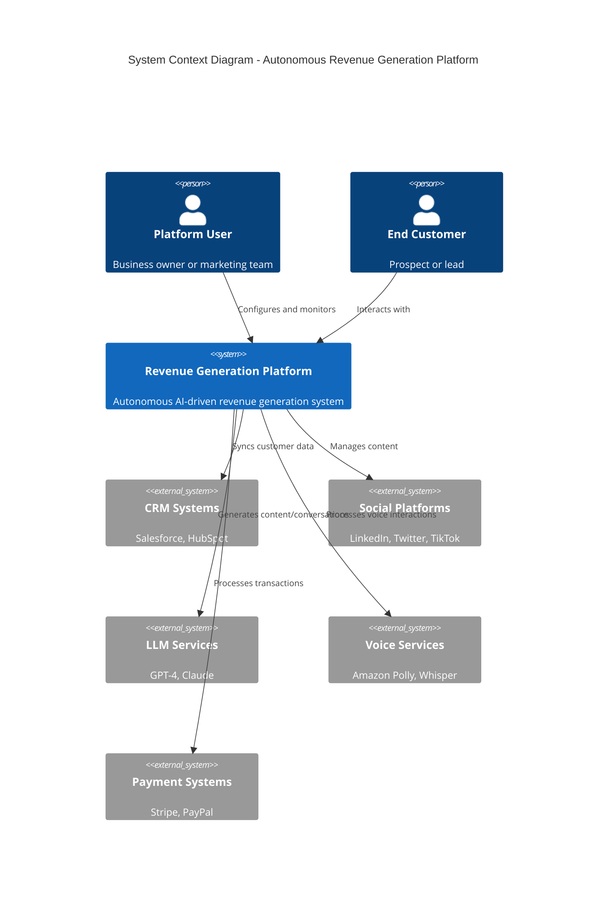
```mermaid
C4Context
    title System Context Diagram - Autonomous Revenue Generation Platform
    
    Person(user, "Platform User", "Business owner or marketing team")
    Person(customer, "End Customer", "Prospect or lead")
    
    System(platform, "Revenue Generation Platform", "Autonomous AI-driven revenue generation system")
    
    System_Ext(crm, "CRM Systems", "Salesforce, HubSpot")
    System_Ext(social, "Social Platforms", "LinkedIn, Twitter, TikTok")
    System_Ext(llm, "LLM Services", "GPT-4, Claude")
    System_Ext(voice, "Voice Services", "Amazon Polly, Whisper")
    System_Ext(payment, "Payment Systems", "Stripe, PayPal")
    
    Rel(user, platform, "Configures and monitors")
    Rel(customer, platform, "Interacts with")
    Rel(platform, crm, "Syncs customer data")
    Rel(platform, social, "Manages content")
    Rel(platform, llm, "Generates content/conversations")
    Rel(platform, voice, "Processes voice interactions")
    Rel(platform, payment, "Processes transactions")
```

### 2.1.2 Container Diagram (C4 Level 1)

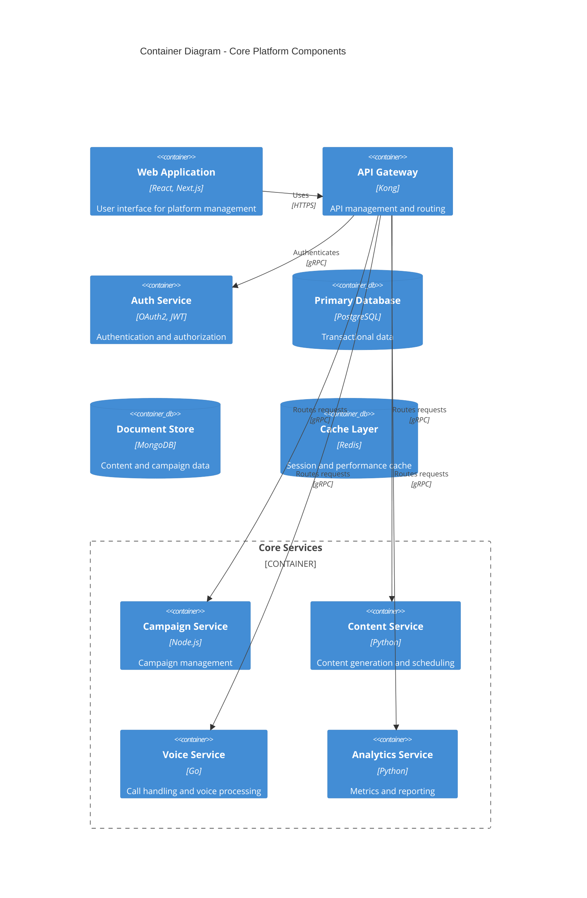
```mermaid
C4Container
    title Container Diagram - Core Platform Components
    
    Container(web, "Web Application", "React, Next.js", "User interface for platform management")
    Container(api, "API Gateway", "Kong", "API management and routing")
    Container(auth, "Auth Service", "OAuth2, JWT", "Authentication and authorization")
    
    Container_Boundary(core, "Core Services") {
        Container(campaign, "Campaign Service", "Node.js", "Campaign management")
        Container(content, "Content Service", "Python", "Content generation and scheduling")
        Container(voice, "Voice Service", "Go", "Call handling and voice processing")
        Container(analytics, "Analytics Service", "Python", "Metrics and reporting")
    }
    
    ContainerDb(primary, "Primary Database", "PostgreSQL", "Transactional data")
    ContainerDb(document, "Document Store", "MongoDB", "Content and campaign data")
    ContainerDb(cache, "Cache Layer", "Redis", "Session and performance cache")
    
    Rel(web, api, "Uses", "HTTPS")
    Rel(api, auth, "Authenticates", "gRPC")
    Rel(api, campaign, "Routes requests", "gRPC")
    Rel(api, content, "Routes requests", "gRPC")
    Rel(api, voice, "Routes requests", "gRPC")
    Rel(api, analytics, "Routes requests", "gRPC")
```

## 2.2 Component Details

### 2.2.1 Core Components

| Component | Purpose | Technology Stack | Scaling Strategy |
| --- | --- | --- | --- |
| API Gateway | Request routing, rate limiting | Kong, Nginx | Horizontal scaling |
| Auth Service | Identity management | OAuth2, JWT, PostgreSQL | Stateless replication |
| Campaign Service | Campaign orchestration | Node.js, Express | Horizontal scaling |
| Content Service | Content generation | Python, FastAPI | Auto-scaling groups |
| Voice Service | Call processing | Go, gRPC | Geographic distribution |
| Analytics Service | Metrics processing | Python, Apache Spark | Cluster scaling |

### 2.2.2 Data Flow Architecture

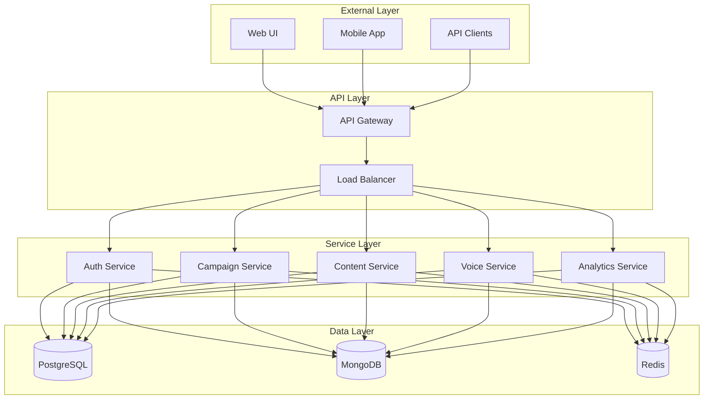
```mermaid
flowchart TD
    subgraph "External Layer"
        A[Web UI]
        B[Mobile App]
        C[API Clients]
    end
    
    subgraph "API Layer"
        D[API Gateway]
        E[Load Balancer]
    end
    
    subgraph "Service Layer"
        F[Auth Service]
        G[Campaign Service]
        H[Content Service]
        I[Voice Service]
        J[Analytics Service]
    end
    
    subgraph "Data Layer"
        K[(PostgreSQL)]
        L[(MongoDB)]
        M[(Redis)]
    end
    
    A & B & C --> D
    D --> E
    E --> F & G & H & I & J
    F & G & H & I & J --> K & L & M
```

## 2.3 Technical Decisions

### 2.3.1 Architecture Patterns

| Pattern | Implementation | Justification |
| --- | --- | --- |
| Microservices | Domain-driven services | Scalability, maintainability |
| Event-Driven | Apache Kafka | Asynchronous processing |
| CQRS | Separate read/write paths | Performance optimization |
| Circuit Breaker | Hystrix | Fault tolerance |

### 2.3.2 Infrastructure Architecture

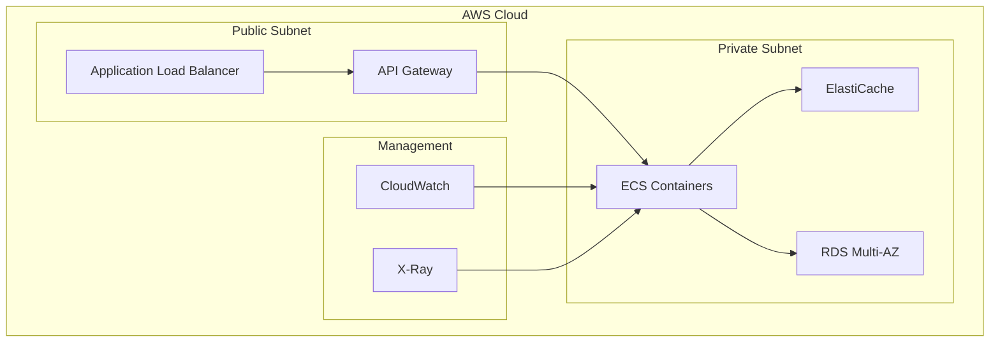
```mermaid
graph TD
    subgraph "AWS Cloud"
        subgraph "Public Subnet"
            A[Application Load Balancer]
            B[API Gateway]
        end
        
        subgraph "Private Subnet"
            C[ECS Containers]
            D[ElastiCache]
            E[RDS Multi-AZ]
        end
        
        subgraph "Management"
            F[CloudWatch]
            G[X-Ray]
        end
    end
    
    A --> B
    B --> C
    C --> D & E
    F & G --> C
```

## 2.4 Cross-Cutting Concerns

### 2.4.1 Monitoring Architecture

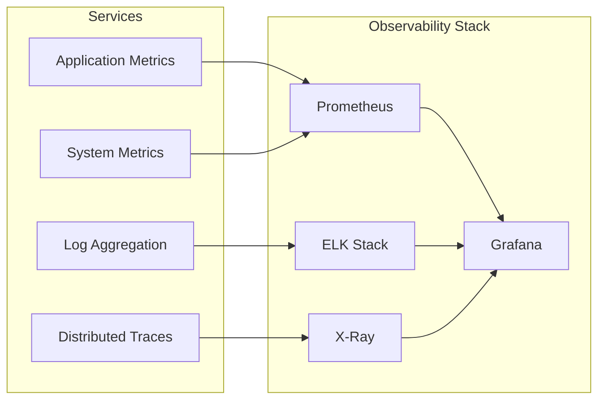
```mermaid
flowchart LR
    subgraph "Observability Stack"
        A[Prometheus]
        B[Grafana]
        C[ELK Stack]
        D[X-Ray]
    end
    
    subgraph "Services"
        E[Application Metrics]
        F[System Metrics]
        G[Distributed Traces]
        H[Log Aggregation]
    end
    
    E --> A
    F --> A
    G --> D
    H --> C
    A --> B
    C --> B
    D --> B
```

### 2.4.2 Security Architecture

| Layer | Implementation | Controls |
| --- | --- | --- |
| Network | AWS VPC, WAF | DDoS protection, IP filtering |
| Application | OAuth2, JWT | Role-based access control |
| Data | KMS, TLS | Encryption at rest/transit |
| Monitoring | CloudTrail, GuardDuty | Threat detection |

### 2.4.3 Deployment Architecture

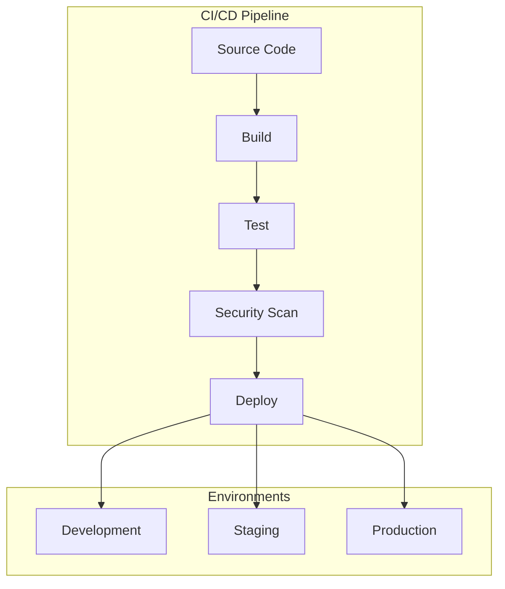
```mermaid
graph TD
    subgraph "CI/CD Pipeline"
        A[Source Code]
        B[Build]
        C[Test]
        D[Security Scan]
        E[Deploy]
    end
    
    subgraph "Environments"
        F[Development]
        G[Staging]
        H[Production]
    end
    
    A --> B --> C --> D --> E
    E --> F & G & H
```

## 2.5 Performance Considerations

| Component | Requirement | Implementation |
| --- | --- | --- |
| API Gateway | \<100ms latency | Edge caching |
| Voice Processing | \<200ms RTT | Geographic routing |
| Content Generation | \<2s response | Queue-based processing |
| Analytics | Real-time updates | Stream processing |
| Database | \<10ms query time | Read replicas |

# 3. SYSTEM COMPONENTS ARCHITECTURE

## 3.1 USER INTERFACE DESIGN

### 3.1.1 Design System Specifications

| Component | Specification | Implementation |
| --- | --- | --- |
| Typography | - Primary: Inter<br>- Secondary: Roboto<br>- Scale: 12/14/16/20/24/32px | CSS variables |
| Color Palette | - Primary: #2563EB<br>- Secondary: #3B82F6<br>- Error: #DC2626<br>- Success: #059669 | Tailwind CSS |
| Spacing | - Base unit: 4px<br>- Grid: 8px increments<br>- Margins: 16/24/32px | CSS Grid/Flexbox |
| Breakpoints | - Mobile: 320px<br>- Tablet: 768px<br>- Desktop: 1024px<br>- Wide: 1440px | Media queries |
| Accessibility | - WCAG 2.1 AA compliant<br>- Keyboard navigation<br>- Screen reader support | ARIA attributes |

### 3.1.2 Core Interface Components

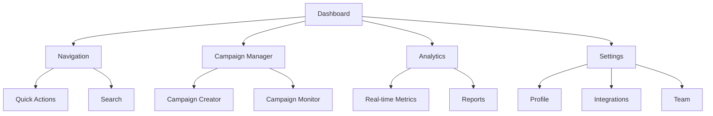
```mermaid
graph TD
    A[Dashboard] --> B[Navigation]
    A --> C[Campaign Manager]
    A --> D[Analytics]
    A --> E[Settings]
    
    B --> F[Quick Actions]
    B --> G[Search]
    
    C --> H[Campaign Creator]
    C --> I[Campaign Monitor]
    
    D --> J[Real-time Metrics]
    D --> K[Reports]
    
    E --> L[Profile]
    E --> M[Integrations]
    E --> N[Team]
```

### 3.1.3 Critical User Flows

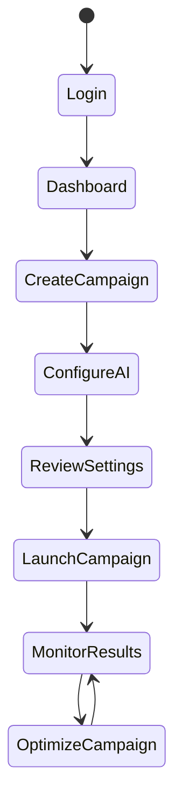
```mermaid
stateDiagram-v2
    [*] --> Login
    Login --> Dashboard
    Dashboard --> CreateCampaign
    CreateCampaign --> ConfigureAI
    ConfigureAI --> ReviewSettings
    ReviewSettings --> LaunchCampaign
    LaunchCampaign --> MonitorResults
    MonitorResults --> OptimizeCampaign
    OptimizeCampaign --> MonitorResults
```

## 3.2 DATABASE DESIGN

### 3.2.1 Schema Design

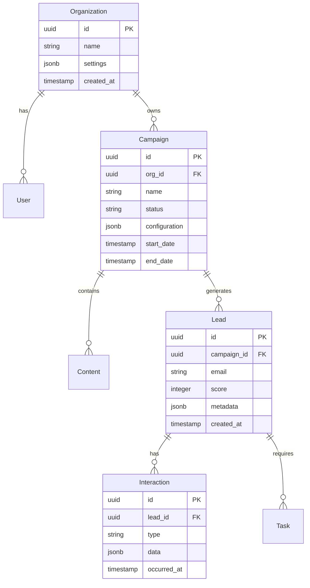
```mermaid
erDiagram
    Organization ||--o{ User : has
    Organization ||--o{ Campaign : owns
    Campaign ||--o{ Content : contains
    Campaign ||--o{ Lead : generates
    Lead ||--o{ Interaction : has
    Lead ||--o{ Task : requires
    
    Organization {
        uuid id PK
        string name
        jsonb settings
        timestamp created_at
    }
    
    Campaign {
        uuid id PK
        uuid org_id FK
        string name
        string status
        jsonb configuration
        timestamp start_date
        timestamp end_date
    }
    
    Lead {
        uuid id PK
        uuid campaign_id FK
        string email
        integer score
        jsonb metadata
        timestamp created_at
    }
    
    Interaction {
        uuid id PK
        uuid lead_id FK
        string type
        jsonb data
        timestamp occurred_at
    }
```

### 3.2.2 Data Management Strategy

| Aspect | Implementation | Details |
| --- | --- | --- |
| Partitioning | Time-based | Monthly partitions for interaction data |
| Indexing | - B-tree for IDs<br>- GiST for JSON<br>- BRIN for timestamps | Optimized for query patterns |
| Replication | Multi-AZ | Synchronous primary-secondary |
| Backup | - Daily full backup<br>- Hourly WAL archiving | 30-day retention |
| Archival | - Quarterly cold storage<br>- S3 deep archive | 7-year retention |

## 3.3 API DESIGN

### 3.3.1 API Architecture

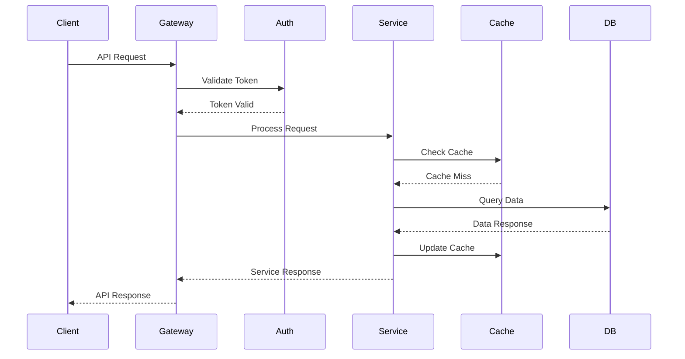
```mermaid
sequenceDiagram
    participant Client
    participant Gateway
    participant Auth
    participant Service
    participant Cache
    participant DB
    
    Client->>Gateway: API Request
    Gateway->>Auth: Validate Token
    Auth-->>Gateway: Token Valid
    Gateway->>Service: Process Request
    Service->>Cache: Check Cache
    Cache-->>Service: Cache Miss
    Service->>DB: Query Data
    DB-->>Service: Data Response
    Service->>Cache: Update Cache
    Service-->>Gateway: Service Response
    Gateway-->>Client: API Response
```

### 3.3.2 API Specifications

| Endpoint | Method | Purpose | Authentication |
| --- | --- | --- | --- |
| /api/v1/campaigns | POST | Create campaign | JWT + API Key |
| /api/v1/leads | GET | List leads | JWT |
| /api/v1/analytics | GET | Fetch metrics | JWT |
| /api/v1/content | PUT | Update content | JWT + API Key |

### 3.3.3 Integration Patterns

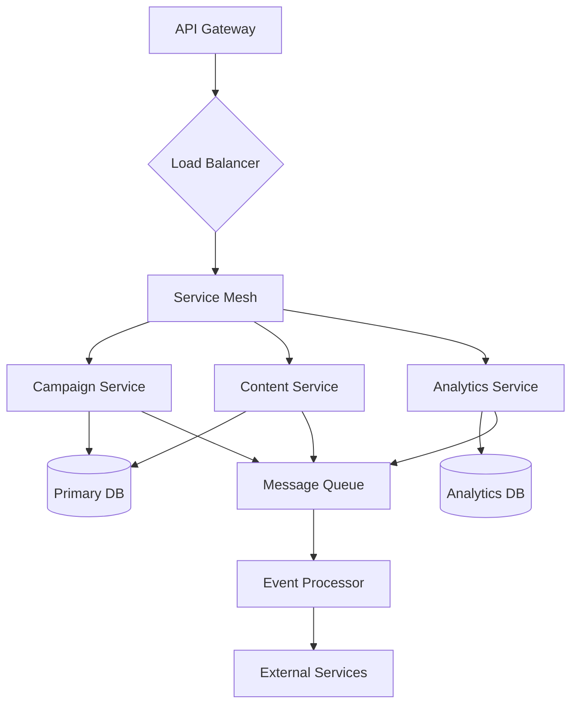
```mermaid
graph TD
    A[API Gateway] --> B{Load Balancer}
    B --> C[Service Mesh]
    
    C --> D[Campaign Service]
    C --> E[Content Service]
    C --> F[Analytics Service]
    
    D --> G[(Primary DB)]
    E --> G
    F --> H[(Analytics DB)]
    
    D --> I[Message Queue]
    E --> I
    F --> I
    
    I --> J[Event Processor]
    J --> K[External Services]
```

### 3.3.4 Security Controls

| Control | Implementation | Purpose |
| --- | --- | --- |
| Authentication | OAuth 2.0 + JWT | Identity verification |
| Authorization | RBAC | Access control |
| Rate Limiting | Token bucket | Abuse prevention |
| Input Validation | JSON Schema | Request validation |
| Encryption | TLS 1.3 | Data in transit |
| API Keys | HMAC-based | Service authentication |

# 4. TECHNOLOGY STACK

## 4.1 PROGRAMMING LANGUAGES

| Platform/Component | Language | Version | Justification |
| --- | --- | --- | --- |
| Backend Services | Python | 3.11+ | - Native AI/ML library support<br>- Extensive LLM integrations<br>- High developer productivity |
| API Layer | Go | 1.20+ | - High performance for real-time processing<br>- Excellent concurrency for voice handling<br>- Low latency requirements |
| Frontend Web | TypeScript | 5.0+ | - Type safety for large application<br>- Enhanced developer experience<br>- Better maintainability |
| Data Processing | Python | 3.11+ | - Rich data science ecosystem<br>- Native async support<br>- ML model integration |
| DevOps Scripts | Python/Bash | 3.11+/5.0+ | - Cross-platform compatibility<br>- AWS SDK support<br>- Automation capabilities |

## 4.2 FRAMEWORKS & LIBRARIES

### Backend Frameworks

| Framework | Version | Purpose | Justification |
| --- | --- | --- | --- |
| FastAPI | 0.100+ | API Development | - High performance async<br>- Native OpenAPI support<br>- WebSocket capabilities |
| LangChain | 0.0.27+ | LLM Integration | - Unified AI model interface<br>- Conversation management<br>- Memory handling |
| Celery | 5.3+ | Task Queue | - Distributed task processing<br>- Scheduling capabilities<br>- Redis integration |
| SQLAlchemy | 2.0+ | ORM | - Database abstraction<br>- Migration support<br>- Transaction management |

### Frontend Frameworks

| Framework | Version | Purpose | Justification |
| --- | --- | --- | --- |
| Next.js | 13+ | React Framework | - Server-side rendering<br>- API routes<br>- Optimized performance |
| TailwindCSS | 3.3+ | Styling | - Utility-first approach<br>- Custom design system<br>- Responsive design |
| Redux Toolkit | 1.9+ | State Management | - Centralized state<br>- TypeScript support<br>- Performance optimized |
| React Query | 4.0+ | Data Fetching | - Cache management<br>- Real-time updates<br>- Optimistic updates |

## 4.3 DATABASES & STORAGE

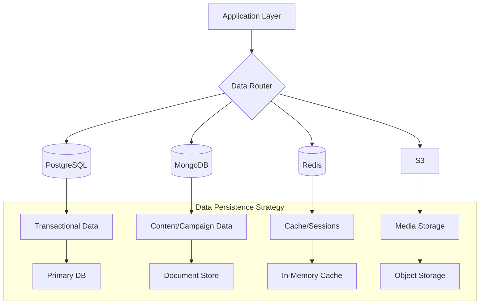
```mermaid
graph TD
    A[Application Layer] --> B{Data Router}
    B --> C[(PostgreSQL)]
    B --> D[(MongoDB)]
    B --> E[(Redis)]
    B --> F[S3]
    
    C --> G[Transactional Data]
    D --> H[Content/Campaign Data]
    E --> I[Cache/Sessions]
    F --> J[Media Storage]
    
    subgraph "Data Persistence Strategy"
        G --> K[Primary DB]
        H --> L[Document Store]
        I --> M[In-Memory Cache]
        J --> N[Object Storage]
    end
```

| Type | Technology | Version | Purpose |
| --- | --- | --- | --- |
| Primary Database | PostgreSQL | 15+ | - Transactional data<br>- User management<br>- Campaign metrics |
| Document Store | MongoDB | 6.0+ | - Content storage<br>- Campaign data<br>- Unstructured data |
| Cache Layer | Redis | 7.0+ | - Session management<br>- Real-time analytics<br>- Task queue |
| Object Storage | AWS S3 | - | - Media files<br>- Backup storage<br>- Static assets |

## 4.4 THIRD-PARTY SERVICES

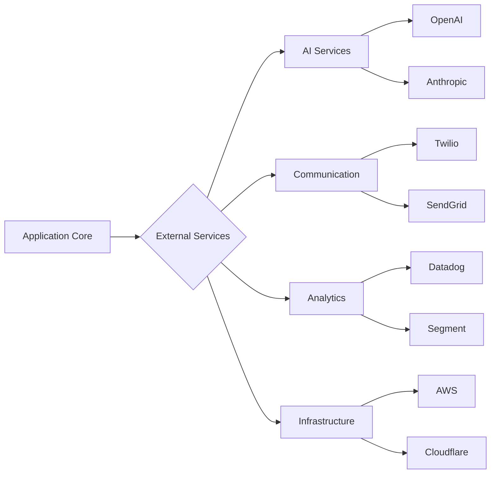
```mermaid
graph LR
    A[Application Core] --> B{External Services}
    B --> C[AI Services]
    B --> D[Communication]
    B --> E[Analytics]
    B --> F[Infrastructure]
    
    C --> G[OpenAI]
    C --> H[Anthropic]
    
    D --> I[Twilio]
    D --> J[SendGrid]
    
    E --> K[Datadog]
    E --> L[Segment]
    
    F --> M[AWS]
    F --> N[Cloudflare]
```

| Category | Service | Purpose | Integration Method |
| --- | --- | --- | --- |
| AI/ML | OpenAI API | LLM Services | REST API |
|  | Anthropic | Conversation AI | REST API |
| Voice | Twilio | Call Handling | SDK/WebHooks |
| Email | SendGrid | Transactional Email | SMTP/API |
| Analytics | Datadog | Monitoring | Agent/API |
| CDN | Cloudflare | Edge Computing | DNS/API |

## 4.5 DEVELOPMENT & DEPLOYMENT

### Development Environment

| Tool | Version | Purpose |
| --- | --- | --- |
| VS Code | Latest | Primary IDE |
| Docker | 24+ | Containerization |
| Git | 2.40+ | Version Control |
| pnpm | 8+ | Package Management |

### Deployment Pipeline

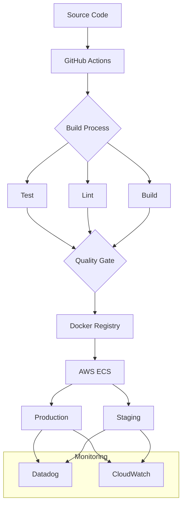
```mermaid
graph TD
    A[Source Code] --> B[GitHub Actions]
    B --> C{Build Process}
    C --> D[Test]
    C --> E[Lint]
    C --> F[Build]
    
    D --> G{Quality Gate}
    E --> G
    F --> G
    
    G --> H[Docker Registry]
    H --> I[AWS ECS]
    
    I --> J[Production]
    I --> K[Staging]
    
    subgraph "Monitoring"
        L[Datadog]
        M[CloudWatch]
    end
    
    J --> L
    K --> L
    J --> M
    K --> M
```

### Infrastructure as Code

| Tool | Version | Purpose |
| --- | --- | --- |
| Terraform | 1.5+ | Infrastructure Provisioning |
| AWS CDK | 2.0+ | Cloud Infrastructure |
| Helm | 3.12+ | Kubernetes Packages |
| Ansible | 2.15+ | Configuration Management |

### Containerization Strategy

| Component | Base Image | Purpose |
| --- | --- | --- |
| API Services | python:3.11-slim | Backend Services |
| Frontend | node:18-alpine | Web Application |
| Workers | python:3.11-slim | Background Tasks |
| Cache | redis:7.0-alpine | In-Memory Cache |

# 5. SYSTEM DESIGN

## 5.1 USER INTERFACE DESIGN

### 5.1.1 Dashboard Layout

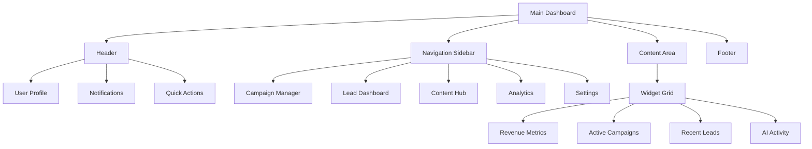
```mermaid
graph TD
    A[Main Dashboard] --> B[Header]
    A --> C[Navigation Sidebar]
    A --> D[Content Area]
    A --> E[Footer]
    
    B --> F[User Profile]
    B --> G[Notifications]
    B --> H[Quick Actions]
    
    C --> I[Campaign Manager]
    C --> J[Lead Dashboard]
    C --> K[Content Hub]
    C --> L[Analytics]
    C --> M[Settings]
    
    D --> N[Widget Grid]
    N --> O[Revenue Metrics]
    N --> P[Active Campaigns]
    N --> Q[Recent Leads]
    N --> R[AI Activity]
```

### 5.1.2 Key Interface Components

| Component | Description | Functionality |
| --- | --- | --- |
| Campaign Manager | - Campaign creation wizard<br>- Status overview<br>- Performance metrics | - Drag-drop campaign builder<br>- Real-time optimization<br>- A/B testing interface |
| Lead Dashboard | - Lead scoring board<br>- Interaction timeline<br>- Action center | - Lead qualification<br>- Task automation<br>- Follow-up scheduling |
| Content Hub | - Content calendar<br>- Asset library<br>- Generation interface | - AI content generation<br>- Multi-platform scheduling<br>- Performance tracking |
| Analytics Center | - Custom dashboards<br>- Report builder<br>- Forecast views | - Real-time metrics<br>- Custom report generation<br>- Data visualization |

## 5.2 DATABASE DESIGN

### 5.2.1 Core Schema

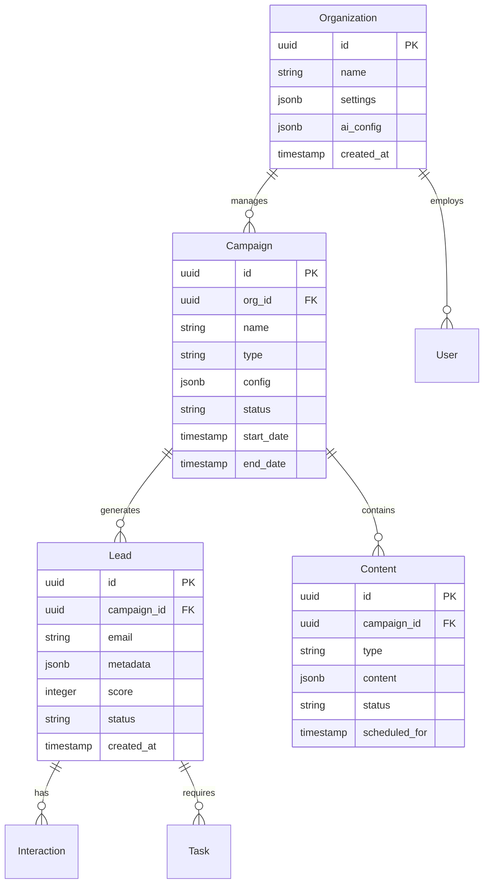
```mermaid
erDiagram
    Organization ||--o{ Campaign : manages
    Organization ||--o{ User : employs
    Campaign ||--o{ Lead : generates
    Campaign ||--o{ Content : contains
    Lead ||--o{ Interaction : has
    Lead ||--o{ Task : requires
    
    Organization {
        uuid id PK
        string name
        jsonb settings
        jsonb ai_config
        timestamp created_at
    }
    
    Campaign {
        uuid id PK
        uuid org_id FK
        string name
        string type
        jsonb config
        string status
        timestamp start_date
        timestamp end_date
    }
    
    Lead {
        uuid id PK
        uuid campaign_id FK
        string email
        jsonb metadata
        integer score
        string status
        timestamp created_at
    }
    
    Content {
        uuid id PK
        uuid campaign_id FK
        string type
        jsonb content
        string status
        timestamp scheduled_for
    }
```

### 5.2.2 Database Architecture

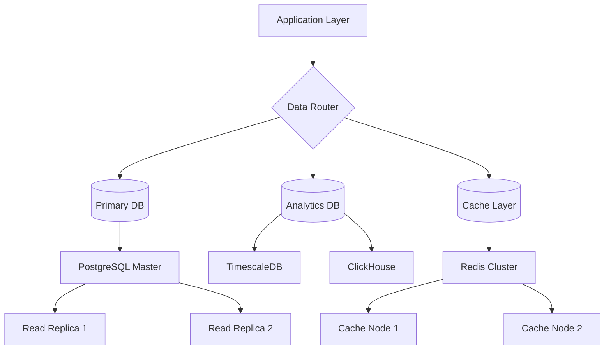
```mermaid
graph TD
    A[Application Layer] --> B{Data Router}
    B --> C[(Primary DB)]
    B --> D[(Analytics DB)]
    B --> E[(Cache Layer)]
    
    C --> F[PostgreSQL Master]
    F --> G[Read Replica 1]
    F --> H[Read Replica 2]
    
    D --> I[TimescaleDB]
    D --> J[ClickHouse]
    
    E --> K[Redis Cluster]
    K --> L[Cache Node 1]
    K --> M[Cache Node 2]
```

## 5.3 API DESIGN

### 5.3.1 REST API Endpoints

| Endpoint | Method | Purpose | Request/Response |
| --- | --- | --- | --- |
| /api/v1/campaigns | POST | Create campaign | Request: Campaign config<br>Response: Campaign ID |
| /api/v1/leads | GET | List leads | Request: Filters<br>Response: Lead array |
| /api/v1/content | PUT | Update content | Request: Content data<br>Response: Updated content |
| /api/v1/analytics | GET | Fetch metrics | Request: Metric params<br>Response: Metric data |

### 5.3.2 API Architecture


```mermaid
sequenceDiagram
    participant Client
    participant Gateway
    participant Auth
    participant Service
    participant Cache
    participant DB
    
    Client->>Gateway: API Request
    Gateway->>Auth: Validate Token
    Auth-->>Gateway: Token Valid
    Gateway->>Service: Process Request
    Service->>Cache: Check Cache
    Cache-->>Service: Cache Miss
    Service->>DB: Query Data
    DB-->>Service: Data Response
    Service->>Cache: Update Cache
    Service-->>Gateway: Service Response
    Gateway-->>Client: API Response
```

### 5.3.3 WebSocket Events

| Event | Direction | Purpose | Payload |
| --- | --- | --- | --- |
| campaign.update | Server→Client | Real-time campaign updates | Campaign status changes |
| lead.new | Server→Client | New lead notification | Lead details |
| metrics.update | Server→Client | Analytics updates | Updated metrics |
| ai.activity | Server→Client | AI operation status | Activity details |

### 5.3.4 Integration Interfaces

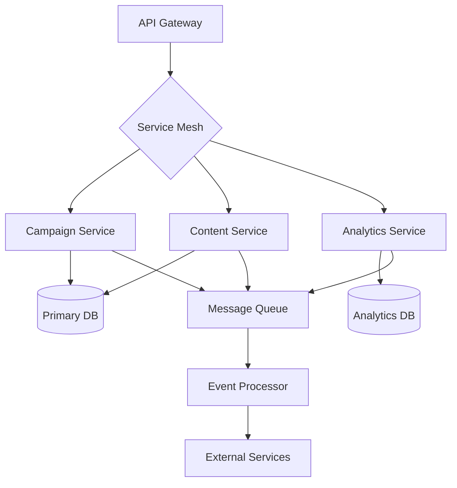
```mermaid
graph TD
    A[API Gateway] --> B{Service Mesh}
    B --> C[Campaign Service]
    B --> D[Content Service]
    B --> E[Analytics Service]
    
    C --> F[(Primary DB)]
    D --> F
    E --> G[(Analytics DB)]
    
    C --> H[Message Queue]
    D --> H
    E --> H
    
    H --> I[Event Processor]
    I --> J[External Services]
```

## 5.4 SYSTEM ARCHITECTURE

### 5.4.1 Component Architecture

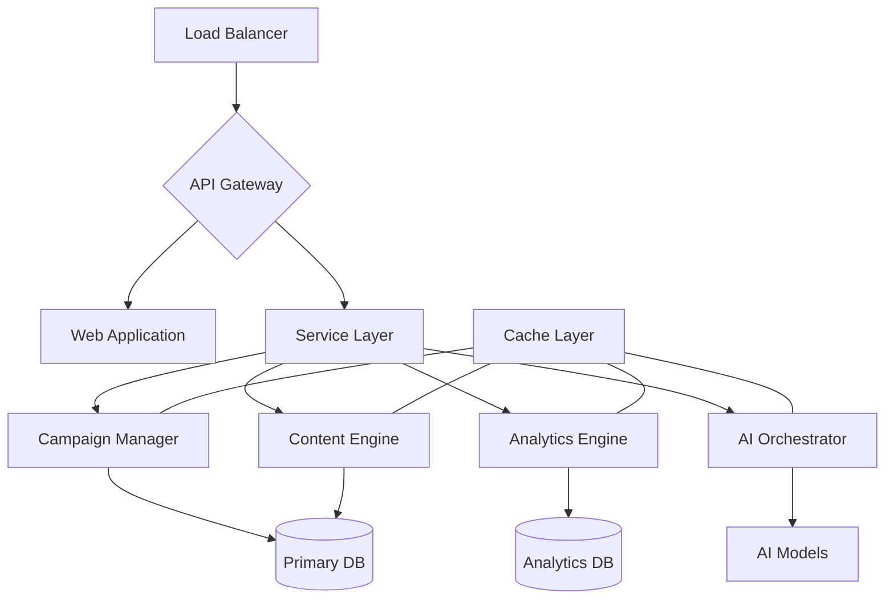
```mermaid
graph TD
    A[Load Balancer] --> B{API Gateway}
    B --> C[Web Application]
    B --> D[Service Layer]
    
    D --> E[Campaign Manager]
    D --> F[Content Engine]
    D --> G[Analytics Engine]
    D --> H[AI Orchestrator]
    
    E --> I[(Primary DB)]
    F --> I
    G --> J[(Analytics DB)]
    H --> K[AI Models]
    
    L[Cache Layer] --- E
    L --- F
    L --- G
    L --- H
```

### 5.4.2 Deployment Architecture

```mermaid
graph TD
    A[CDN] --> B[Load Balancer]
    B --> C[Application Cluster]
    
    subgraph "Application Tier"
        C --> D[Web Servers]
        C --> E[API Servers]
        C --> F[Worker Nodes]
    end
    
    subgraph "Data Tier"
        G[(Primary DB)]
        H[(Analytics DB)]
        I[Cache Cluster]
    end
    
    D --> G
    E --> G
    F --> G
    D --> H
    E --> H
    F --> H
    D --> I
    E --> I
    F --> I
```

### 5.4.3 Security Architecture

| Layer | Implementation | Controls |
| --- | --- | --- |
| Network | AWS VPC | - Security groups<br>- Network ACLs<br>- VPC endpoints |
| Application | OAuth 2.0 + JWT | - Role-based access<br>- API authentication<br>- Rate limiting |
| Data | Encryption | - At-rest encryption<br>- In-transit encryption<br>- Key management |
| Monitoring | AWS CloudWatch | - Audit logging<br>- Threat detection<br>- Compliance monitoring |

# 6. USER INTERFACE DESIGN

## 6.1 Design System

| Element | Specification | Implementation |
| --- | --- | --- |
| Typography | Primary: Inter<br>Secondary: Roboto<br>Headings: 32/24/20/16px<br>Body: 16/14px | CSS variables |
| Colors | Primary: #2563EB<br>Secondary: #3B82F6<br>Success: #059669<br>Error: #DC2626<br>Gray: #6B7280 | Tailwind CSS |
| Spacing | Base unit: 4px<br>Padding: 16/24px<br>Margins: 16/24/32px | CSS Grid/Flexbox |
| Shadows | Light: 0 2px 4px rgba(0,0,0,0.1)<br>Medium: 0 4px 6px rgba(0,0,0,0.1) | CSS variables |
| Breakpoints | Mobile: 320px<br>Tablet: 768px<br>Desktop: 1024px<br>Wide: 1440px | Media queries |

## 6.2 Core Layouts

### 6.2.1 Dashboard Layout

```
+----------------------------------------------------------+
|  [#] Brand    [@] Profile    [!] Alerts    [=] Settings   |
+----------------------------------------------------------+
|        |                                                  |
|  [#]   |   Revenue Overview                              |
|  Home  |   [============================] 75% to goal     |
|        |   +----------------+  +----------------+         |
|  [*]   |   |  Active Calls  |  |  Lead Quality  |        |
|  Leads |   |     24/50      |  |    87% [?]     |        |
|        |   +----------------+  +----------------+         |
|  [$]   |                                                  |
|  Sales |   Recent Activity                               |
|        |   +----------------------------------------+    |
|  [@]   |   | [i] New lead captured - John Smith     |    |
|  Team  |   | [i] Campaign "Summer23" started        |    |
|        |   | [!] AI model retraining required       |    |
|  [=]   |   +----------------------------------------+    |
| Config |                                                  |
+----------------------------------------------------------+
```

### 6.2.2 Campaign Creator

```
+----------------------------------------------------------+
|  Create New Campaign                                 [x]   |
+----------------------------------------------------------+
|                                                           |
|  Campaign Name: [..............................]          |
|                                                           |
|  Campaign Type:                                           |
|  (•) Outbound Calls                                      |
|  ( ) Social Media                                        |
|  ( ) Email Sequence                                      |
|                                                           |
|  Target Audience: [v]                                     |
|  +------------------+                                     |
|  | B2B Technology   |                                     |
|  | Enterprise      |                                     |
|  | Small Business  |                                     |
|  +------------------+                                     |
|                                                           |
|  AI Voice Selection:                                      |
|  [v] Professional Male                                    |
|                                                           |
|  Budget: [$] [...........] Daily Limit                   |
|                                                           |
|  [ ] Enable A/B Testing                                   |
|  [ ] Auto-optimize for conversions                        |
|                                                           |
|        [Cancel]    [Preview]    [Launch Campaign]         |
+----------------------------------------------------------+
```

### 6.2.3 Lead Management Interface

```
+----------------------------------------------------------+
|  Active Leads                        [+] Add Lead    [?]  |
+----------------------------------------------------------+
|  Filter: [.......] [v] Status  [v] Score  [Apply]         |
+----------------------------------------------------------+
|  Name          Company    Score   Status    Actions        |
|  +------------------------------------------------+      |
|  | John Smith   TechCo    [****]  Active   [Call] [=]   |
|  | Lisa Wong    DevInc    [***]   New      [Call] [=]   |
|  | Mike Davis   SaaS Ltd  [**]    Cold     [Call] [=]   |
|  +------------------------------------------------+      |
|                                                           |
|  Lead Details                                            |
|  +------------------------------------------------+      |
|  | [i] Contact Info      [^] Files    [@] History |      |
|  |                                                 |      |
|  | Phone: (555) 123-4567                          |      |
|  | Email: john@techco.com                         |      |
|  | Last Contact: 2 days ago                       |      |
|  | Notes: Interested in enterprise plan           |      |
|  +------------------------------------------------+      |
+----------------------------------------------------------+
```

### 6.2.4 Analytics Dashboard

```
+----------------------------------------------------------+
|  Performance Analytics                    [Export] [Share] |
+----------------------------------------------------------+
|  Date Range: [v] Last 30 Days                             |
|                                                           |
|  Key Metrics                                              |
|  +----------------+  +----------------+  +----------------+|
|  |   Revenue      |  |   Conversion   |  |    Calls      ||
|  |   $124,500     |  |      23%       |  |    1,245      ||
|  | [^] +15% MoM   |  | [v] -2% MoM    |  | [^] +5% MoM   ||
|  +----------------+  +----------------+  +----------------+|
|                                                           |
|  Campaign Performance                                     |
|  +------------------------------------------------+      |
|  | Campaign    Spend    ROAS    Status    Trend    |      |
|  | Summer23    $5,000   3.2x    Active    [^^^^]   |      |
|  | Q4-Promo    $3,200   2.8x    Paused    [^v^^]   |      |
|  +------------------------------------------------+      |
|                                                           |
|  AI Insights                                             |
|  [i] Best performing audience: Enterprise Tech            |
|  [i] Recommended action: Increase budget for Summer23     |
|  [!] Opportunity: Similar audiences in Healthcare         |
+----------------------------------------------------------+
```

## 6.3 Component Legend

| Symbol | Meaning |
| --- | --- |
| \[#\] | Dashboard/Menu icon |
| \[@\] | User/Profile icon |
| \[!\] | Alert/Warning |
| \[=\] | Settings/Configuration |
| \[?\] | Help/Information |
| \[$\] | Financial/Payment related |
| \[+\] | Add/Create new |
| \[x\] | Close/Delete |
| \[v\] | Dropdown menu |
| \[^\] | Trending up |
| \[...\] | Text input field |
| \[\*\*\*\*\] | Rating/Score indicator |
| (•) | Selected radio button |
| ( ) | Unselected radio button |
| \[ \] | Checkbox |
| \[====\] | Progress bar |
| +--+ | Container/Box border |

## 6.4 Interaction Patterns

| Pattern | Implementation |
| --- | --- |
| Navigation | Single-page application with side navigation |
| Data Entry | Inline validation with immediate feedback |
| Loading States | Skeleton screens with progress indicators |
| Notifications | Toast messages for system alerts |
| Modals | Center-screen with backdrop blur |
| Tables | Sortable columns with pagination |
| Forms | Step-by-step wizard for complex flows |
| Charts | Interactive with hover tooltips |

## 6.5 Responsive Behavior

| Breakpoint | Layout Adjustments |
| --- | --- |
| Mobile (\<768px) | - Stack all columns<br>- Collapse sidebar<br>- Full-width cards<br>- Bottom navigation |
| Tablet (768-1024px) | - Two-column layout<br>- Collapsible sidebar<br>- Grid-based cards<br>- Top navigation |
| Desktop (\>1024px) | - Three-column layout<br>- Fixed sidebar<br>- Dashboard grid<br>- Full navigation |

# 7. SECURITY CONSIDERATIONS

## 7.1 AUTHENTICATION AND AUTHORIZATION

### 7.1.1 Authentication Methods

| Method | Implementation | Use Case |
| --- | --- | --- |
| OAuth 2.0 + OIDC | Auth0/AWS Cognito | Primary user authentication |
| API Keys | HMAC-based | Service-to-service auth |
| JWT | RS256 signing | Session management |
| MFA | TOTP/SMS | High-security operations |
| SSO | SAML 2.0 | Enterprise users |

### 7.1.2 Authorization Model

```mermaid
graph TD
    A[User Request] --> B{Authentication}
    B -->|Valid| C{Authorization}
    B -->|Invalid| D[401 Unauthorized]
    
    C -->|Authorized| E[Access Granted]
    C -->|Unauthorized| F[403 Forbidden]
    
    subgraph "RBAC System"
        G[Roles] --> H[Permissions]
        H --> I[Resources]
    end
    
    C --> G
```

### 7.1.3 Role-Based Access Control

| Role | Permissions | Access Level |
| --- | --- | --- |
| Admin | - Full system access<br>- User management<br>- Security settings | Full |
| Manager | - Campaign management<br>- Analytics access<br>- Team management | High |
| Content Creator | - Content creation<br>- Social media posting<br>- Asset management | Medium |
| Analyst | - View analytics<br>- Export reports<br>- View campaigns | Low |
| API User | - Specific API endpoints<br>- Rate-limited access | Limited |

## 7.2 DATA SECURITY

### 7.2.1 Encryption Standards

| Data State | Method | Implementation |
| --- | --- | --- |
| At Rest | AES-256-GCM | AWS KMS |
| In Transit | TLS 1.3 | AWS Certificate Manager |
| In Memory | Secure memory handling | Runtime encryption |
| Backups | AES-256 | S3 server-side encryption |
| Keys | HSM-based key management | AWS CloudHSM |

### 7.2.2 Data Classification

```mermaid
graph TD
    A[Data Classification] --> B[Public]
    A --> C[Internal]
    A --> D[Confidential]
    A --> E[Restricted]
    
    B --> F[No Encryption]
    C --> G[Standard Encryption]
    D --> H[Enhanced Encryption]
    E --> I[Maximum Security]
    
    subgraph "Security Controls"
        F --> J[Basic Controls]
        G --> K[Standard Controls]
        H --> L[Enhanced Controls]
        I --> M[Maximum Controls]
    end
```

### 7.2.3 Data Protection Measures

| Category | Measure | Implementation |
| --- | --- | --- |
| PII Data | - Field-level encryption<br>- Data masking<br>- Access logging | Custom encryption service |
| Payment Data | - PCI DSS compliance<br>- Tokenization<br>- Secure vault | Stripe integration |
| AI Training Data | - Data anonymization<br>- Secure processing<br>- Access controls | Custom ML pipeline |
| Audit Logs | - Immutable storage<br>- Retention policies<br>- Encryption | CloudWatch Logs |

## 7.3 SECURITY PROTOCOLS

### 7.3.1 Security Architecture

```mermaid
graph TD
    A[Security Layers] --> B[Network Security]
    A --> C[Application Security]
    A --> D[Data Security]
    A --> E[Identity Security]
    
    B --> F[WAF]
    B --> G[DDoS Protection]
    
    C --> H[Input Validation]
    C --> I[Output Encoding]
    
    D --> J[Encryption]
    D --> K[Access Control]
    
    E --> L[Authentication]
    E --> M[Authorization]
```

### 7.3.2 Security Controls

| Control Type | Implementation | Purpose |
| --- | --- | --- |
| Preventive | - WAF rules<br>- Input validation<br>- Rate limiting | Prevent attacks |
| Detective | - IDS/IPS<br>- Log monitoring<br>- Threat detection | Identify threats |
| Corrective | - Auto-scaling<br>- Failover<br>- Backup restoration | Recover from incidents |
| Deterrent | - Access logging<br>- Security headers<br>- SSL/TLS | Discourage attacks |

### 7.3.3 Security Monitoring

| Component | Monitoring Method | Alert Threshold |
| --- | --- | --- |
| API Gateway | - Request rate<br>- Error rate<br>- Latency | - \>1000 req/sec<br>- \>1% error rate<br>- \>200ms latency |
| Authentication | - Failed attempts<br>- Token usage<br>- MFA failures | - \>5 failures/min<br>- Unusual patterns<br>- Geographic anomalies |
| Data Access | - Unauthorized attempts<br>- Unusual patterns<br>- Volume anomalies | - Any unauthorized access<br>- \>100% normal volume<br>- Off-hours access |

### 7.3.4 Incident Response

```mermaid
stateDiagram-v2
    [*] --> Detection
    Detection --> Analysis
    Analysis --> Containment
    Containment --> Eradication
    Eradication --> Recovery
    Recovery --> PostIncident
    PostIncident --> [*]
    
    state Detection {
        [*] --> AlertTriggered
        AlertTriggered --> IncidentLogged
    }
    
    state Analysis {
        [*] --> ThreatAssessment
        ThreatAssessment --> ImpactAnalysis
    }
    
    state Containment {
        [*] --> IsolateSystem
        IsolateSystem --> SecureEvidence
    }
```

### 7.3.5 Compliance Requirements

| Standard | Requirements | Implementation |
| --- | --- | --- |
| CCPA | - Data inventory<br>- Privacy notices<br>- User rights management | Privacy portal |
| GDPR | - Consent management<br>- Data portability<br>- Right to erasure | Custom API endpoints |
| SOC 2 | - Access controls<br>- Change management<br>- Risk assessment | AWS security controls |
| PCI DSS | - Cardholder data security<br>- Network monitoring<br>- Vulnerability management | Third-party processor |

# 8. INFRASTRUCTURE

## 8.1 DEPLOYMENT ENVIRONMENT

### 8.1.1 Environment Architecture

```mermaid
graph TD
    A[Production] --> B{Load Balancer}
    B --> C[Region 1]
    B --> D[Region 2]
    
    subgraph "Primary Region"
        C --> E[AZ 1]
        C --> F[AZ 2]
        
        E --> G[Container Cluster]
        F --> H[Container Cluster]
        
        G --> I[(Primary DB)]
        H --> I
        
        G --> J[Cache Cluster]
        H --> J
    end
    
    subgraph "Failover Region"
        D --> K[AZ 1]
        D --> L[AZ 2]
        
        K --> M[Container Cluster]
        L --> N[Container Cluster]
        
        M --> O[(Replica DB)]
        N --> O
        
        M --> P[Cache Cluster]
        N --> P
    end
```

### 8.1.2 Environment Specifications

| Environment | Purpose | Configuration |
| --- | --- | --- |
| Production | Live system | - Multi-region deployment<br>- High availability<br>- Auto-scaling<br>- Full monitoring |
| Staging | Pre-production testing | - Single region<br>- Production-like setup<br>- Automated testing<br>- Performance monitoring |
| Development | Development and testing | - Local containers<br>- Mocked services<br>- Debug enabled<br>- Test data |
| DR | Disaster recovery | - Cross-region backup<br>- Automated failover<br>- Data replication<br>- Regular testing |

## 8.2 CLOUD SERVICES

### 8.2.1 Primary Cloud Provider (AWS)

| Service | Purpose | Configuration |
| --- | --- | --- |
| ECS Fargate | Container orchestration | - Serverless containers<br>- Auto-scaling<br>- Load balancing |
| RDS Aurora | Primary database | - Multi-AZ deployment<br>- Auto-scaling storage<br>- Read replicas |
| ElastiCache | Caching layer | - Redis cluster<br>- Multi-AZ<br>- Auto-failover |
| S3 | Object storage | - Versioning enabled<br>- Lifecycle policies<br>- Cross-region replication |
| CloudFront | CDN | - Edge locations<br>- SSL/TLS<br>- WAF integration |

### 8.2.2 Cloud Architecture

```mermaid
graph TD
    A[CloudFront] --> B{Route 53}
    B --> C[ALB]
    C --> D[ECS Fargate]
    
    D --> E[Application Tier]
    D --> F[Worker Tier]
    
    E --> G[RDS Aurora]
    E --> H[ElastiCache]
    F --> G
    F --> H
    
    E --> I[S3]
    F --> I
    
    J[CloudWatch] --> D
    J --> G
    J --> H
```

## 8.3 CONTAINERIZATION

### 8.3.1 Container Strategy

| Component | Base Image | Configuration |
| --- | --- | --- |
| API Services | python:3.11-slim | - Multi-stage builds<br>- Non-root user<br>- Health checks |
| Frontend | node:18-alpine | - Nginx for static files<br>- Build optimization<br>- Cache layers |
| Workers | python:3.11-slim | - Minimal dependencies<br>- Volume mounts<br>- Resource limits |
| Monitoring | grafana/grafana | - Persistent storage<br>- Plugin support<br>- Custom dashboards |

### 8.3.2 Container Architecture

```mermaid
graph TD
    A[Docker Registry] --> B{Container Orchestrator}
    B --> C[API Containers]
    B --> D[Frontend Containers]
    B --> E[Worker Containers]
    
    C --> F[Shared Storage]
    D --> F
    E --> F
    
    C --> G[Service Mesh]
    D --> G
    E --> G
    
    H[Monitoring] --> C
    H --> D
    H --> E
```

## 8.4 ORCHESTRATION

### 8.4.1 ECS Configuration

| Component | Configuration | Scaling Policy |
| --- | --- | --- |
| API Service | - CPU: 1 vCPU<br>- Memory: 2GB<br>- Min instances: 2 | - Target CPU: 70%<br>- Target Memory: 80%<br>- Scale-out: +2<br>- Scale-in: -1 |
| Frontend | - CPU: 0.5 vCPU<br>- Memory: 1GB<br>- Min instances: 2 | - Target CPU: 60%<br>- Request count based<br>- Scale-out: +2<br>- Scale-in: -1 |
| Workers | - CPU: 2 vCPU<br>- Memory: 4GB<br>- Min instances: 1 | - Queue length based<br>- Message count<br>- Scale-out: +1<br>- Scale-in: -1 |

### 8.4.2 Service Mesh

```mermaid
graph TD
    A[API Gateway] --> B{Service Mesh}
    B --> C[API Service]
    B --> D[Content Service]
    B --> E[Analytics Service]
    
    C --> F[Service Discovery]
    D --> F
    E --> F
    
    C --> G[Circuit Breaker]
    D --> G
    E --> G
    
    H[Monitoring] --> B
```

## 8.5 CI/CD PIPELINE

### 8.5.1 Pipeline Architecture

```mermaid
graph TD
    A[Source Code] --> B{GitHub Actions}
    B --> C[Build]
    B --> D[Test]
    B --> E[Security Scan]
    
    C --> F[Container Registry]
    D --> F
    E --> F
    
    F --> G{Deployment}
    G --> H[Development]
    G --> I[Staging]
    G --> J[Production]
    
    K[Quality Gates] --> H
    K --> I
    K --> J
```

### 8.5.2 Pipeline Stages

| Stage | Tools | Actions |
| --- | --- | --- |
| Build | - Docker<br>- pnpm<br>- Poetry | - Dependency installation<br>- Code compilation<br>- Asset building<br>- Container creation |
| Test | - Jest<br>- Pytest<br>- Cypress | - Unit tests<br>- Integration tests<br>- E2E tests<br>- Coverage reports |
| Security | - SonarQube<br>- Snyk<br>- OWASP ZAP | - Code analysis<br>- Dependency scanning<br>- Container scanning<br>- Vulnerability assessment |
| Deploy | - Terraform<br>- AWS CDK<br>- GitHub Actions | - Infrastructure as Code<br>- Environment promotion<br>- Rollback capability<br>- Health checks |

### 8.5.3 Deployment Strategy

| Environment | Strategy | Rollback Plan |
| --- | --- | --- |
| Development | Direct deployment | Immediate container replacement |
| Staging | Blue/Green | Switch traffic to previous version |
| Production | Canary | Gradual traffic shift with monitoring |

# 8. APPENDICES

## 8.1 ADDITIONAL TECHNICAL SPECIFICATIONS

### 8.1.1 AI Model Specifications

| Model Type | Provider | Use Case | Configuration |
| --- | --- | --- | --- |
| LLM | OpenAI GPT-4 | Content generation | - Max tokens: 8000<br>- Temperature: 0.7<br>- Top-p: 0.9 |
| Voice | Anthropic Claude | Conversation handling | - Context window: 100k<br>- Real-time processing<br>- Custom prompts |
| Analytics | Custom ML | Predictive modeling | - TensorFlow based<br>- Retraining interval: 24h<br>- Accuracy threshold: 85% |

### 8.1.2 Integration Requirements

```mermaid
graph TD
    A[External Systems] --> B{Integration Layer}
    B --> C[CRM Systems]
    B --> D[Social Platforms]
    B --> E[Voice Services]
    B --> F[Payment Systems]
    
    C --> G[Salesforce]
    C --> H[HubSpot]
    
    D --> I[LinkedIn]
    D --> J[TikTok]
    D --> K[Twitter]
    
    E --> L[Amazon Polly]
    E --> M[Whisper]
    
    F --> N[Stripe]
    F --> O[PayPal]
```

### 8.1.3 Performance Benchmarks

| Component | Metric | Target | Monitoring |
| --- | --- | --- | --- |
| API Gateway | Response time | \<100ms | Datadog |
| Voice Processing | Latency | \<200ms | CloudWatch |
| Content Generation | Completion time | \<2s | Custom metrics |
| Database Queries | Query time | \<10ms | RDS Performance Insights |

## 8.2 GLOSSARY

| Term | Definition |
| --- | --- |
| Autonomous Revenue Generation | Self-operating system that generates revenue through AI-driven processes without human intervention |
| Campaign Optimization | Automated process of improving marketing campaign performance using AI and analytics |
| Content Distribution | Multi-channel deployment of marketing materials across various platforms |
| Lead Qualification | AI-driven process of evaluating potential customers based on defined criteria |
| Model Fine-tuning | Process of customizing AI models with company-specific data for improved performance |
| Revenue Pipeline | End-to-end process of converting prospects into paying customers |
| Service Mesh | Infrastructure layer handling service-to-service communication |
| Voice Synthesis | Generation of human-like speech from text using AI models |

## 8.3 ACRONYMS

| Acronym | Full Form |
| --- | --- |
| AI | Artificial Intelligence |
| API | Application Programming Interface |
| ARR | Annual Recurring Revenue |
| AWS | Amazon Web Services |
| CCPA | California Consumer Privacy Act |
| CDN | Content Delivery Network |
| CRM | Customer Relationship Management |
| GDPR | General Data Protection Regulation |
| IaaS | Infrastructure as a Service |
| IOPS | Input/Output Operations Per Second |
| JWT | JSON Web Token |
| KPI | Key Performance Indicator |
| LLM | Large Language Model |
| ML | Machine Learning |
| PaaS | Platform as a Service |
| REST | Representational State Transfer |
| ROI | Return on Investment |
| SaaS | Software as a Service |
| SDK | Software Development Kit |
| SLA | Service Level Agreement |
| SOC | System and Organization Controls |
| SQL | Structured Query Language |
| SSL | Secure Sockets Layer |
| STT | Speech to Text |
| TLS | Transport Layer Security |
| TTS | Text to Speech |
| UI | User Interface |
| UX | User Experience |
| WAF | Web Application Firewall |

## 8.4 REFERENCE DOCUMENTATION

### 8.4.1 Technical Standards

```mermaid
graph LR
    A[Standards] --> B[API Standards]
    A --> C[Security Standards]
    A --> D[Data Standards]
    
    B --> E[OpenAPI 3.0]
    B --> F[GraphQL]
    
    C --> G[OAuth 2.0]
    C --> H[OWASP]
    
    D --> I[JSON Schema]
    D --> J[CloudEvents]
```

### 8.4.2 External Documentation

| Resource | URL | Purpose |
| --- | --- | --- |
| AWS Documentation | aws.amazon.com/docs | Cloud infrastructure reference |
| OpenAI API | platform.openai.com/docs | LLM integration guide |
| Stripe API | stripe.com/docs | Payment processing integration |
| TikTok Business API | developers.tiktok.com | Social media integration |
| Twilio API | twilio.com/docs | Voice service integration |

### 8.4.3 Internal Documentation

| Document | Purpose | Location |
| --- | --- | --- |
| API Documentation | API endpoint specifications | /docs/api |
| Architecture Guide | System design patterns | /docs/architecture |
| Data Dictionary | Database schema reference | /docs/data |
| Security Policies | Security protocols and procedures | /docs/security |
| Style Guide | UI/UX standards | /docs/ui |